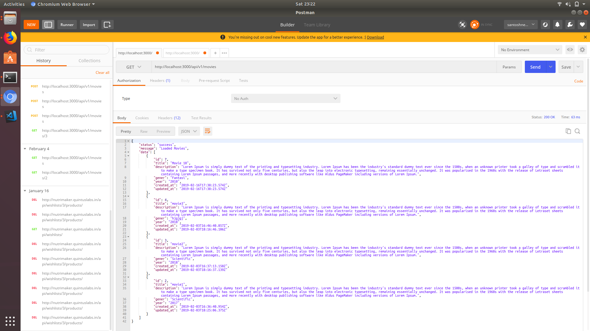
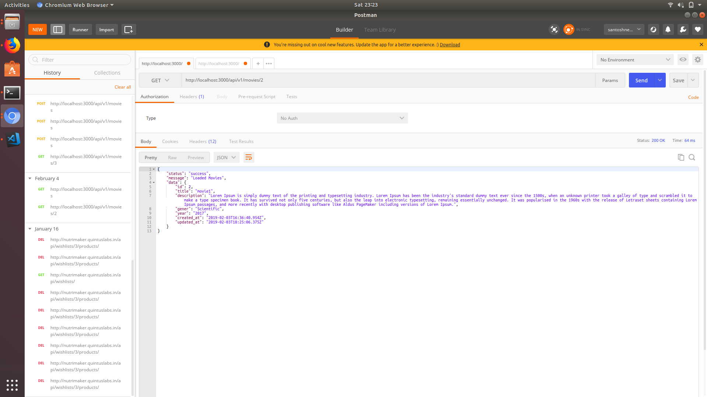
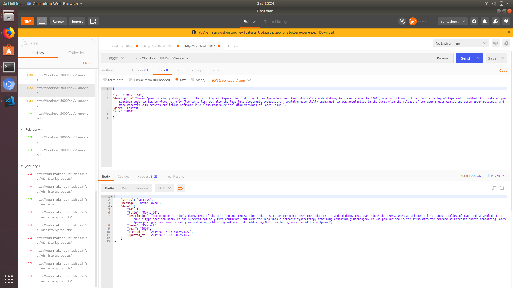
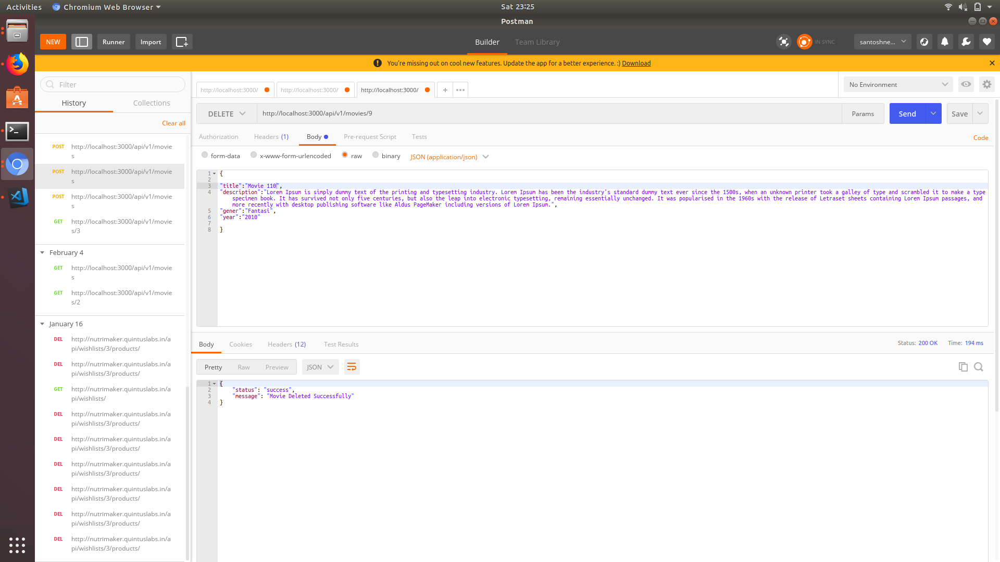

# README

This README would normally document whatever steps are necessary to get the
application up and running.

Things you may want to cover:

* Ruby version = ruby-2.6.0

* System dependencies

* Configuration

* Database creation

* Database initialization

* How to run the test suite

* Services (job queues, cache servers, search engines, etc.)

* Deployment instructions

* ...

Following are the list of things should be considered while building a REST api.

» HTTP Methods

A well-designed RESTful API should support most commonly used HTTP methods (GET, POST, PUT and DELETE). There are other HTTP methods like OPTIONS, HEAD but these are used most often. Each method should be used depending on the type of operation you are performing.

GET 	To fetch a resource

POST 	To create a new resource

PUT 	To update existing resource

DELETE 	To delete a resource

» HTTP Status Code

HTTP status codes in the response body tells client application what action should be taken with the response. For an example if the response code 200, it means on the server side the request is processed successfully and you can expect updated data in the response. As well if the status code is 401, the request is not authorized. An example cause for 401 could be api key is invalid.

It is not necessary to support all HTTP status codes, but supporting at least the following codes should be good enough. Check out list of http codes from restapitutorial.com and Wikipedia

200 	OK

201 	Created

304 	Not Modified

400 	Bad Request

401 	Unauthorized

403 	Forbidden

404 	Not Found

422 	Unprocessable Entity

500 	Internal Server Error

» URL Structure

In REST design the URL endpoints should be well formed and should be easily understandable. Every URL for a resource should be uniquely identified. If your API needs an API key to access, the api key should be kept in HTTP headers instead of including it in URL.

For an example:

GET http://abc.com/v1/movies/11 – Will give the details of a movie whose id is 11

POST http://abc.com/v1/movies – Will create a new movie record

» API Versioning

There is a huge discussion on API versioning whether to maintain api version in the URL or in the HTTP request headers. Even though it is recommended that version should be included in the request headers, I feel comfortable to maintain it in the URL itself as it is very convenient on the client side to migrate from one version to another.

Example:

http://abc.com/v1/movies

http://abc.com/v2/movies

» Content Type

The Content Type in HTTP headers specifies the kind of the data should be transferred between server and client. Depending upon the data your API supporting you need to set the content type.

For an example, JSON Mime type should be Content-Type: application/json, for XML Content-Type: application/xml. You can find list of supported MIME Types

API Url Structure

|URL|  Method | Parameters  | Description  |
|---|---|---|---|
|  /movies| GET  |   |   Fetching all Movies |
|  /movies  |  POST |  title, description, gener, year  |  create new record |
|  /movies/:id | GET  |   |   Fetching single Movie |
|  /movies/:id  | PUT  |   |  	Updating single Movie |
|  /movies/:id  | DELETE  |  movie |  	status 	Deleting single Movie |
 
 
  
 
   
  
    
 
   
 
   
 
 
 
 
 
 
 
 
 
